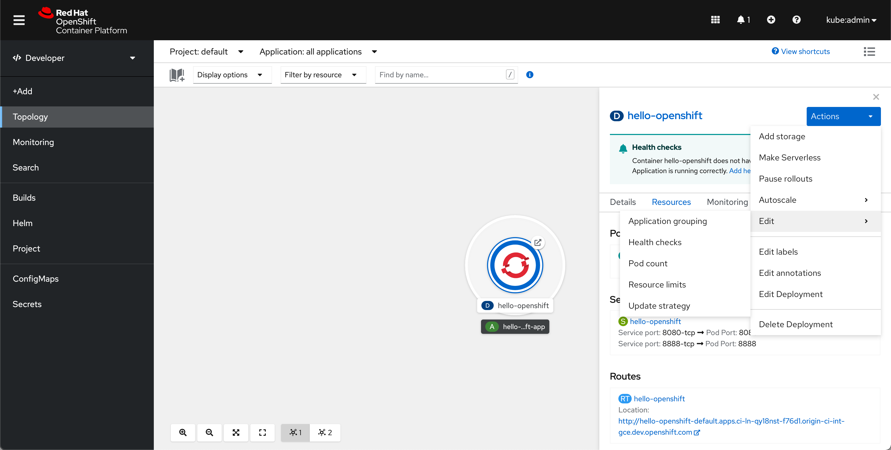
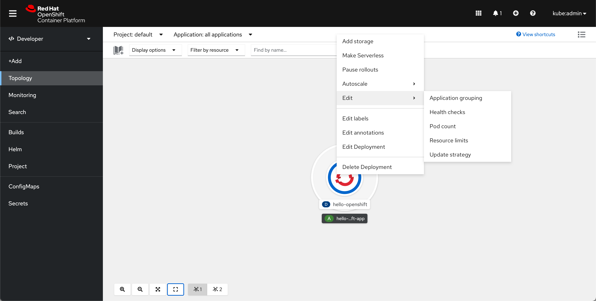

# Action menus

## Kebab and resource Actions menus

- A resource's Actions menu are accessible from a number of places, such as:
  1. List view kebab
  2. Details page actions dropdown
  3. Topology side panel
  4. Topology right click action on a resource

**List view kebab**

**Details page actions dropdown**

**Topology side panel**

**Topology right click action on a resource**

- When the actions are accessible from an Actions dropdown, the dropdown should be styled as a primary blue dropdown.
- Exceptions are acceptable in the cases where a different action(s) have been identified as the view's primary action. In these cases, the primary action is usually pulled out of the dropdown and is styled as a primary button or dropdown to the left of the Actions dropdown, which will have secondary styling. (E.g., Secrets details pages)

## Organization of Actions menu items

Action menus should be separated into multiple sections. The ordering of sections and actions in the menu should follow the following pattern:
1. **Resource specific actions**
  * These should be ordered with standalone actions listed first, followed by flyouts (i.e., if there is more than one flyout, they should be grouped at the bottom of this section). The default logic for ordering both the standalone actions and flyouts is alphabetical.
  * Exceptions are acceptable in the cases where an action may be dynamic. (E.g., `Pause rollouts` becomes `Resume rollouts`, but the action should not move from its original position)
2. **"Universal" actions**
  * These actions are available for every resource in the console. These should be listed in the following order:
    1. `Edit labels`
    2. `Edit annotations`
    3. `Edit {resource_type}`
3. **Delete resource action**
  * The last section of each Actions menu should have the `Delete {resource_type}` action
4. **Submenus**
  * In this example, the resource has more than two actions that are Edit actions, and are thus put into an Edit submenu.
  * Resources may have more than one submenu.
  * The default logic for ordering these actions is alphabetical.

5. **Additional Edit action**
  * In cases where a resource was created via an import flow, they may have an additional Edit action.
  * The Edit action should be listed below the default `Edit {resource_type}` action.
  * The Edit action name will reflect the import flow used to create the resource. The following are the possible Edit labels for this action:
    * `Edit JAR import`
    * `Edit Git import`
    * `Edit Container import`

Naming of actions:
- Actions for resources do not need to include the resource’s name they affect, unless many resource types can be affected in the actions menu.
- Create, Edit, Delete are the exceptions in that they always include the full name of the resource they affect.
- Action labels should follow the [capitalization convention](http://openshift.github.io/openshift-origin-design/conventions/documentation/capitalization.html).

---

## Bulk Actions Menu

- This is a convention that hasn’t yet been implemented in the console. [Learn more here](http://openshift.github.io/openshift-origin-design/designs/administrator/future-openshift/bulk-actions/)
- List views of resources may support multi-select and a bulk “Actions” menu.

Actions in the menu should follow the following pattern:
- Unique bulk actions to that resource should appear above default bulk resource actions
- Add Labels (when present)
- Add Annotations (when present)
- Delete [Resource Name(s)]

---
